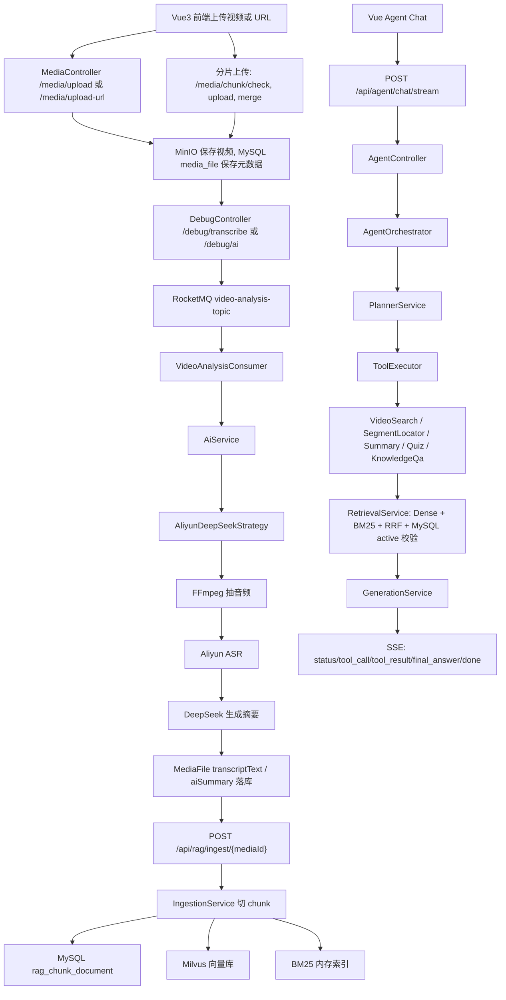

# SmartVideo-Engine

SmartVideo-Engine 是一个基于 Spring Boot、Vue 3、MySQL、Redis、RocketMQ、MinIO、Milvus、Ollama Embedding 和 DeepSeek/OpenAI 兼容模型的视频理解与 Agent 问答平台。系统支持视频上传、在线视频导入、音频抽取、ASR 转写、AI 摘要、RAG 入库、视频内检索、片段定位、自测题生成和 SSE 流式 Agent 问答。

## 核心调用链



## 模块结构

- `server/`: Spring Boot 后端，包含上传、AI 分析、RocketMQ 消费、RAG 入库检索、Agent 编排和 SSE 接口。
- `client/`: Vue 3 前端，包含上传工作台、AI 摘要侧栏和 Agent Chat。
- `docker-compose.yml`: MySQL、Redis、MinIO、RocketMQ、Milvus、etcd 本地依赖。
- `docs/CODEX_AUDIT_REPORT.md`: 本次工程审查报告。

## 本地依赖

- JDK 21
- Maven
- Node.js 20+
- Docker / Docker Compose
- FFmpeg
- yt-dlp
- Ollama，本地 embedding 模型需要执行 `ollama pull bge-large`
- DeepSeek API Key
- 阿里云 ASR API Key
- 如需让阿里云 ASR 访问本地 MinIO，通常还需要公网可访问的 `MINIO_PUBLIC_ENDPOINT`

## 配置

后端默认读取 `server/src/main/resources/application.properties`。该文件只放安全默认值和环境变量占位，本地私密覆盖请放到 `server/src/main/resources/application.properties.local` 或通过环境变量注入。

关键环境变量示例：

```powershell
$env:DEEPSEEK_API_KEY="your-key"
$env:DEEPSEEK_BASE_URL="https://api.deepseek.com"
$env:ALIYUN_API_KEY="your-key"
$env:MINIO_PUBLIC_ENDPOINT="https://your-ngrok-domain.ngrok-free.app"
$env:YTDLP_PATH="E:/yt-dlp/yt-dlp.exe"
$env:FFMPEG_DIR="E:/ffmpeg/bin"
```

重要配置项：

```properties
agent.max-steps=5
agent.tool.timeout-ms=30000
rag.retrieval.hybrid-enabled=true
rag.bm25.rebuild-on-startup=true
rag.smoke-test.enabled=false
chat.memory.max-messages=12
chat.memory.summary-trigger-messages=16
chat.memory.ttl-days=7
chat.memory.summary-enabled=true
embedding.base-url=http://localhost:11434
embedding.model-name=bge-large
milvus.collection-name=smart_video_chunks
milvus.dimension=1024
```

## 快速启动

1. 启动基础设施：

```powershell
docker compose up -d
```

2. 准备 Ollama embedding 模型：

```powershell
ollama pull bge-large
```

3. 启动后端：

```powershell
cd server
mvn spring-boot:run
```

后端默认地址：`http://localhost:9090`

4. 启动前端：

```powershell
cd client
npm install
npm run dev
```

前端默认地址：`http://localhost:5173`

## 主要接口

上传与媒体：

```http
POST /media/upload
POST /media/upload-url
POST /media/chunk/check
POST /media/chunk/upload
POST /media/chunk/merge
GET  /media/list?userId=1
GET  /media/access/{id}
DELETE /media/delete?id=1&userId=1
```

AI 分析与调试：

```http
GET /debug/transcribe?id=1
GET /debug/ai?id=1
GET /debug/ai-direct?id=1
GET /debug/download?id=1
GET /debug/token-usage?userId=1
```

RAG 与 Agent：

```http
POST /api/rag/ingest/{mediaId}
POST /api/rag/chat
POST /api/rag/chat/sync
DELETE /api/rag/memory/{sessionId}
POST /api/agent/chat
POST /api/agent/chat/stream
```

Agent SSE 请求示例：

```json
{
  "question": "这个视频里 RAG 是怎么做的？",
  "sessionId": "demo-session",
  "videoId": 1
}
```

SSE 事件：

- `agent_status`: Agent 当前状态。
- `tool_call`: Planner 选择的工具调用。
- `tool_result`: 工具执行结果。
- `final_answer`: 最终答案。
- `done`: 流式响应结束。
- `error`: 错误信息。

## RAG 设计

- MySQL 表 `rag_chunk_document` 是 chunk 原文和版本状态的 source of truth。
- Milvus 存储 dense embedding，metadata 中带 `chunkId`、`videoId`、`deleted`、`version`。
- BM25 是进程内倒排索引，启动时可通过 `rag.bm25.rebuild-on-startup=true` 从 MySQL 重建。
- 检索链路支持 dense + BM25 + RRF 融合，并在进入 LLM 前通过 MySQL 校验 active chunk。
- 当 hybrid 检索开启且 dense 外部依赖不可用时，会降级使用 BM25 候选；纯 dense 检索仍暴露异常，便于定位依赖故障。

## 测试与构建

后端测试：

```powershell
cd server
mvn -q test
```

前端构建：

```powershell
cd client
npm run build
```

默认构建输出到 `client/tmp-build-dist`，用于避开 Windows 本地旧 `client/dist` 产物被占用时的 EPERM。若需要传统 `client/dist` 输出，可运行：

```powershell
cd client
npm run build:dist
```

## 已知限制

- 全链路运行依赖 MySQL、Redis、MinIO、RocketMQ、Milvus、Ollama、FFmpeg、yt-dlp、DeepSeek 和阿里云 ASR；单元测试使用 mock 覆盖核心本地逻辑，不代表外部服务实际可用。
- 前端主页面仍有多处直连 `http://localhost:9090` 的调用，适合本地演示；如部署到非本机环境，应统一抽取为环境变量。
- 默认 `npm run build` 输出到 `client/tmp-build-dist`；当前工作区旧 `client/dist` 文件存在 Windows 占用问题，传统 `npm run build:dist` 可能失败。
- `DebugController` 承担了演示和调试入口，生产化应拆分正式 API、调试 API 和权限控制。
- BM25 是单进程内存索引，多实例部署时需要启动重建或替换为共享检索组件。
- Markdown 渲染会转义原始 HTML，避免 XSS；这意味着模型输出中的 HTML 标签不会作为 HTML 生效。
