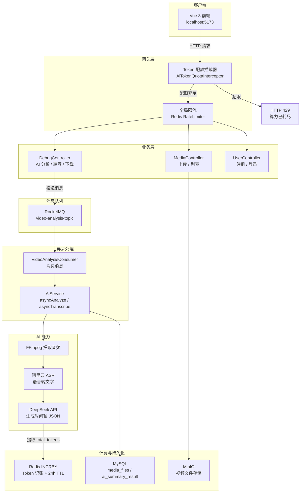

<div align="center">

  <h1>SmartVideo-Engine</h1>
  <h3>智能视频内容理解平台</h3>

  <p>
    <strong>全链路异步化 / Token 成本核算与限流 / AI 智能时间轴导览</strong>
  </p>

  <p>
    
    
    
    
    
    
  </p>
</div>

<br/>

## 项目简介

SmartVideo-Engine 是一套完整的视频内容理解解决方案，支持用户上传本地视频或粘贴在线链接，自动完成**音频提取 → 语音转文字 → AI 智能总结**全流程，并以**可交互的时间轴**形式呈现结果。

区别于传统视频平台只解决"存储和播放"，本项目的核心价值在于**"理解"**——让 AI 替你阅读视频内容，并以结构化的方式与你互动。

<br/>

## 亮点功能

### 💰 精细化 Token 成本核算与限流

大模型 API 按 Token 计费，传统 QPS 限流已不适用。本项目将计费模型直接嵌入业务层：

```
请求进入 → Interceptor 查 Redis 配额 → 超限返回 HTTP 429 → 未超限放行
                                                              ↓
DeepSeek API 返回 → 提取 usage.total_tokens → Redis INCRBY 累加 → 设 24h TTL 每日重置
```

- Redis Key 格式：`user:token:usage:{userId}`
- 默认日配额：50000 Token（可在 `application.properties` 调整）
- 超限响应：HTTP 429 + "今日 AI 算力已耗尽"
- 全局异常处理器统一拦截 `TokenQuotaExceededException`

### 🎬 AI 智能时间轴导览

将 AI 输出的长文本转化为可交互的结构化组件：

```
视频文字 → System Prompt 约束输出格式 → DeepSeek 返回 JSON 数组 → 前端解析渲染
                                                                      ↓
                                            [时间轴列表] ← 点击节点 → 视频跳转播放
```

- Prompt 强制模型返回 `[{"startTime":120,"topic":"主题","summary":"摘要"}]` 格式
- 前端自动解析 JSON 渲染时间轴 UI（非 JSON 降级为 Markdown 渲染）
- 点击任意时间节点直接定位视频对应秒数并播放

<br/>

## 系统架构



<br/>

## 技术栈

| 层级 | 技术 | 说明 |
|:---|:---|:---|
| 后端框架 | Spring Boot 3.5 + Undertow | 高并发 Servlet 容器 |
| 消息队列 | RocketMQ 4.9 | 异步解耦，削峰填谷 |
| 数据库 | MySQL 8.0 + MyBatis Plus | 结构化数据持久化 |
| 缓存 / 锁 | Redis 7.x + Redisson | 分片状态、分布式锁、Token 限额 |
| 对象存储 | MinIO | 视频文件存储，兼容 S3 |
| AI 模型 | DeepSeek（硅基流动 API） | 内容总结 + 时间轴生成 |
| 语音识别 | 阿里云百炼 ASR（paraformer-v2） | 音频转文字 |
| 音视频处理 | FFmpeg + yt-dlp | 音频提取、在线视频下载 |
| 前端 | Vue 3 + Vite | 响应式单页应用 |

<br/>

## 开发环境要求

| 组件 | 版本 | 备注 |
|:---|:---|:---|
| JDK | 21 | 必须，Spring Boot 3.5 最低要求 |
| Node.js | v20+ | 前端构建依赖 |
| Docker | 20+ | 运行中间件 |
| MySQL | 8.0 | Docker 提供 |
| Redis | 7.x | Docker 提供 |
| RocketMQ | 4.9.4 | Docker 提供 |
| FFmpeg | 2025+ Snapshot | 本地安装 |
| yt-dlp | Latest | 本地安装，定期 `yt-dlp -U` 更新 |

<br/>

## 本地部署（完整流程）

### 第一步：克隆项目

```bash
git clone https://github.com/beibei31/SmartVideo-Engine.git
cd SmartVideo-Engine
```

### 第二步：启动中间件

```bash
# 一键启动 MySQL, Redis, MinIO, RocketMQ
docker-compose up -d
```

验证所有容器运行正常：

```bash
docker ps --format "table {{.Names}}\t{{.Status}}\t{{.Ports}}"
```

期望输出：

| 容器名 | 端口 |
|--------|------|
| mysql-media | 3307 |
| redis-media | 6379 |
| minio | 9000, 9001 |
| rmqnamesrv | 9876 |
| rmqbroker | 10911, 10909 |
| rmqdashboard | 8180 |

> RocketMQ Dashboard 可通过 [http://localhost:8180](http://localhost:8180) 访问，用于监控消息队列状态。

### 第三步：配置后端

编辑 `server/src/main/resources/application.properties`：

```properties
# ===== 数据库（保持默认即可，与 docker-compose 一致）=====
spring.datasource.url=jdbc:mysql://localhost:3307/media_db?useSSL=false&serverTimezone=Asia/Shanghai&characterEncoding=utf-8&allowPublicKeyRetrieval=true
spring.datasource.username=root
spring.datasource.password=root

# ===== Redis（保持默认即可）=====
spring.data.redis.host=localhost
spring.data.redis.port=6379

# ===== MinIO（保持默认即可）=====
minio.endpoint=http://localhost:9000
minio.accessKey=minioadmin
minio.secretKey=minioadmin
minio.bucketName=media

# ===== RocketMQ（保持默认即可）=====
rocketmq.name-server=127.0.0.1:9876

# ===== AI 密钥（必须替换为你自己的）=====
ai.deepseek.api-key=sk-你的密钥
ai.aliyun.api-key=sk-你的阿里云密钥

# ===== Token 每日配额（可按需调整）=====
ai.token.daily-quota=50000

# ===== 本地工具路径（按你的实际路径填写）=====
tool.ffmpeg.dir=D:/ffmpeg/bin
tool.ytdlp.path=D:/yt-dlp/yt-dlp.exe
```

### 第四步：启动后端

```powershell
cd server

# 设置 JDK 21
$env:JAVA_HOME = "D:\soft\Java\jdk-21"

# 编译 + 测试
mvn clean test

# 启动服务
mvn spring-boot:run
```

看到以下输出表示启动成功：

```
Started ServerApplication in x.xxx seconds (process running for x.xxx)
```

后端运行在 [http://localhost:9090](http://localhost:9090)。

### 第五步：启动前端

```powershell
cd client

# 首次运行需安装依赖
npm install

# 启动开发服务器
npm run dev
```

浏览器打开 [http://localhost:5173](http://localhost:5173) 即可使用。

<br/>

## 使用流程

### 1. 注册登录

点击右上角「登录 / 注册」→ 注册新账号 → 登录。

### 2. 上传视频

两种方式任选：

- **本地文件**：点击左侧 "LOCAL FILE" 选择视频文件
- **在线链接**：在右侧输入框粘贴 B 站 / YouTube 等视频链接

上传完成后在工作台可见卡片，状态从 `PROCESSING` 变为 `READY`。

### 3. 提取文字

点击卡片上的「提取文字」→ 右侧侧栏展示全量语音转写结果。

### 4. AI 智能总结 + 时间轴导览

点击「AI 智能总结」→ 等待后端调用 DeepSeek 分析 → 右侧侧栏出现：

- **视频播放器**（上方）
- **可点击的时间轴列表**（下方）

点击任意时间节点，视频自动跳转并播放。

### 5. 下载音频

点击「下载音频」→ 浏览器自动下载 MP3 文件。

<br/>

## Token 配额测试

### 查看当前用量

```bash
# 连接 Redis 容器
docker exec -it redis-media redis-cli

# 查看某用户的 Token 用量（替换 1 为实际 userId）
GET user:token:usage:1

# 查看 TTL
TTL user:token:usage:1
```

### 模拟配额耗尽

```bash
# 写入一个超过阈值的用量
SET user:token:usage:1 50001

# 然后在前端点击「AI 智能总结」
# 期望：页面弹出 "今日 AI 算力已耗尽"

# 清理测试数据
DEL user:token:usage:1
```

<br/>

## 项目结构

```
SmartVideo-Engine/
├── client/                              # Vue 3 前端
│   └── src/
│       └── App.vue                      # 主页面（时间轴导览 + Token 超限提示）
├── server/                              # Spring Boot 后端
│   └── src/main/java/com/example/server/
│       ├── config/
│       │   └── WebConfig.java           # 拦截器注册 + 跨域配置
│       ├── consumer/
│       │   └── VideoAnalysisConsumer.java  # RocketMQ 消费者
│       ├── controller/
│       │   ├── DebugController.java     # AI 分析 / 转写 / 下载
│       │   ├── MediaController.java     # 上传 / 列表 / 删除
│       │   └── UserController.java      # 注册 / 登录
│       ├── entity/
│       │   ├── AiSummaryResult.java     # AI 时间轴结果（独立存储）
│       │   ├── MediaFile.java           # 视频文件元数据
│       │   └── User.java               # 用户
│       ├── exception/
│       │   ├── TokenQuotaExceededException.java  # Token 超限异常
│       │   └── GlobalExceptionHandler.java       # 全局异常 → HTTP 429
│       ├── interceptor/
│       │   └── AiTokenQuotaInterceptor.java      # Token 配额前置检查
│       ├── service/
│       │   ├── AiService.java           # 异步 AI 分析编排
│       │   ├── TokenUsageService.java   # Redis Token 记账服务
│       │   └── TokenUsageContext.java   # ThreadLocal 传递 userId
│       ├── strategy/
│       │   └── impl/
│       │       └── AliyunDeepSeekStrategy.java  # AI 分析策略实现
│       └── utils/
│           ├── DeepSeekUtils.java       # DeepSeek API 调用 + Token 提取
│           ├── AliyunAsrUtils.java      # 阿里云语音识别
│           ├── MinioUtils.java          # MinIO 文件操作
│           └── YtDlpUtils.java          # 在线视频下载
├── docker-compose.yml                   # MySQL + Redis + MinIO + RocketMQ
└── 测试计划与运行指南.md                 # 详细测试步骤
```

<br/>

## License

MIT — 详见 [LICENSE](LICENSE)
