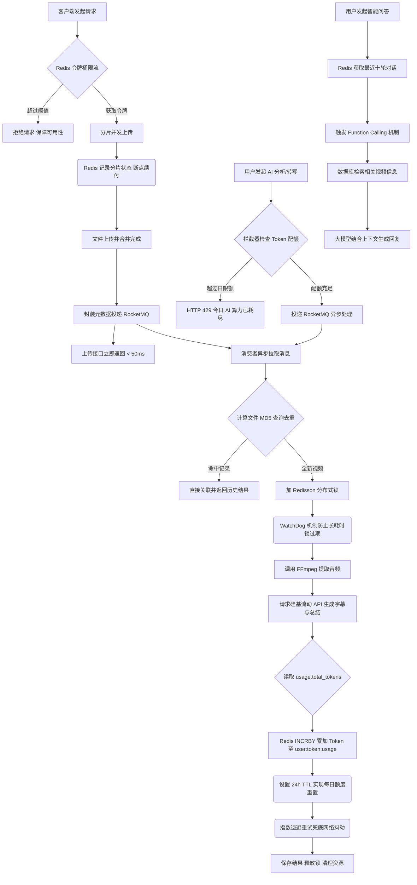

<div align="center">

  <h1 align="center">SmartVideo-Engine — 智能视频内容理解平台</h1>

  <p align="center">
    <strong>全链路异步化 / 长任务稳定性保障 / Token 成本核算与限流 / AI 智能时间轴导览</strong>
  </p>

  <p align="center">
    <a href="https://github.com/beibei31/SmartVideo-Engine">
      
    </a>
    <a href="https://github.com/beibei31/SmartVideo-Engine">
      
    </a>
    <a href="https://github.com/beibei31/SmartVideo-Engine">
      
    </a>
    <a href="https://github.com/beibei31/SmartVideo-Engine">
      
    </a>
    <a href="https://github.com/beibei31/SmartVideo-Engine">
      
    </a>
    <a href="https://github.com/beibei31/SmartVideo-Engine">
      
    </a>
  </p>
</div>

<br/>

**SmartVideo-Engine** 是一个集成用户鉴权、视频上传、音频提取及 AI 自动总结的全链路视频内容理解平台。

针对视频处理场景中常见的 **"长耗时阻塞"**、**"高并发资源冲突"** 以及 **"大文件传输不稳定"** 等痛点，本项目抛弃了传统的同步处理模式，基于 **RocketMQ + Redisson + 分片续传** 重构了系统架构。在此基础上，进一步实现了 **精细化 Token 成本核算与限流** 以及 **AI 智能时间轴导览**，将大模型 API 调用成本与业务层深度绑定，并将 AI 产出的非结构化文本转化为前端可交互的结构化组件。

视频平台大多只解决了"存储"和"播放"的问题。SmartVideo-Engine 旨在解决"理解"的问题——通过异步架构处理长耗时任务，利用 AI 提取核心价值，让视频不再是黑盒。

<br/>

## 核心功能

### 1. 🚀 稳定上传体验

- **分片断点续传**：针对 GB 级大文件（如 4K 课程录像），采用 Redis 维护上传分片状态。实测在 20% 丢包率弱网环境下，上传成功率从 25% 提升至 99%。
- **秒级响应**：引入 RocketMQ 将耗时的"视频分析"动作剥离出主线程。用户上传完成后仅需 50ms 即可得到反馈，后续处理全异步化，彻底告别页面转圈卡死。

### 2. 🛡️ 高并发防护

- **分布式锁兜底**：使用 Redisson + WatchDog 机制。当多个用户同时上传同一视频时，系统通过 MD5 内容指纹识别，利用分布式锁防止重复转码与 AI 分析，节省算力与 Token 开销。
- **削峰填谷**：Controller 层集成 Redis 令牌桶算法，有效遏制恶意请求与突发流量，保护后端服务不被击穿。

### 3. 🔄 任务处理流程详解

- **稳健入口**：文件直传 MinIO，避免应用服务器带宽瓶颈。
- **异步解耦**：上传成功后，Controller 仅发送一条消息至 RocketMQ 即刻返回，将长耗时任务留给后台。
- **安全消费**：消费者通过 Redisson 锁住视频 MD5，确保同一视频在同一时刻只有一个线程在处理。
- **智能重试**：针对第三方 AI API 可能的网络抖动，设计了指数退避重试机制，确保任务最终一致性。

### 4. 💰 精细化 Token 成本核算与限流

- **Token 实时记账**：每次大模型 API 调用（DeepSeek）结束后，从响应体中提取 `usage.total_tokens`，通过 Redis `INCRBY` 原子累加至 `user:token:usage:{userId}` Key，并自动设置 24 小时 TTL 实现每日额度重置。
- **前置拦截器**：Spring Boot Interceptor 拦截 `/debug/ai`、`/debug/transcribe` 等 AI 相关接口，从请求头/参数/媒体归属中解析用户身份，若当日累计 Token 超过配置阈值（默认 50000），直接抛出 `TokenQuotaExceededException` 并返回 HTTP 429 "今日 AI 算力已耗尽"。
- **与传统限流的区别**：传统 QPS 限流只管"每秒几次请求"，Token 核算直击大模型时代的计费命脉——将 API 调用成本压到用户维度做颗粒度控制。
- **配置项**：`ai.token.daily-quota=50000`（可在 `application.properties` 中按需调整）

### 5. 🎬 AI 智能时间轴导览

- **结构化 Prompt**：System Prompt 强制要求大模型返回严格 JSON 数组（`[{"startTime":120,"topic":"分布式锁原理","summary":"..."}]`），而非自由文本，确保下游可靠解析。
- **持久化存储**：时间轴 JSON 原文写入 `media_files.ai_summary` 并另存至 `ai_summary_result` 表，前端无需额外接口即可拉取。
- **前端联动播放器**：侧栏渲染为可点击的时间轴列表（仿 Element Plus Timeline 风格），点击任意节点触发 `videoElement.currentTime = startTime` 并自动播放——将 AI 产出的非结构化文本变成前端可强交互的结构化组件。

<br/>

## 技术栈

### 后端

SpringBoot 3.5 + RocketMQ 4.9 + Redis 7.x + MySQL 8.0 + MyBatis Plus + MinIO + FFmpeg + DeepSeek (硅基流动 API)

### 部署

Docker / Docker Compose

### 前端

Vue 3 + Vite + Marked

<br/>

## 系统架构流程图



<br/>

## 开发环境

| 组件 | 版本 | 备注 |
| :--- | :--- | :--- |
| **JDK** | 21 | 支持 Spring Boot 3.5 即可 |
| **Node** | v20+ | 前端构建依赖 |
| **MySQL** | 8.0 | Docker 镜像 `mysql:8.0` |
| **Redis** | 7.x | Docker 镜像 `redis:latest` |
| **RocketMQ** | 4.9.4 | Docker 镜像 `apache/rocketmq:4.9.4` |
| **DeepSeek** | 硅基流动 API | 新用户注册送 14 元免费额度 |
| **FFmpeg** | Latest | 推荐 2025 年后的 Snapshot 版本 |
| **yt-dlp** | Latest | 建议定期 `update` 保持解析库最新 |

<br/>

## 本地部署

### 1. 中间件部署 (Docker Compose)

项目所有中间件已封装为 Docker Compose 文件，在项目根目录下一键启动：

```bash
# 包含 MySQL, Redis, MinIO, RocketMQ (Namesrv + Broker), RocketMQ Dashboard
docker-compose up -d
```

启动后确认所有容器状态正常：

```bash
docker ps --format "table {{.Names}}\t{{.Status}}\t{{.Ports}}"
```

### 2. 后端配置

在启动后端前，修改以下配置：

**配置数据库密码**（确保与 docker-compose 中的 MySQL 密码一致）：

```properties
spring.datasource.password=root
```

**配置 AI 模型密钥与 Token 配额**（默认使用硅基流动 API）：

```properties
# 前往 https://cloud.siliconflow.cn/ 申请免费密钥
ai.deepseek.api-key=sk-你的密钥xxxxxxxxxxxxxxxx

# 每日每用户 Token 配额（默认 50000，可按需调整）
ai.token.daily-quota=50000
```

**配置 FFmpeg 和 yt-dlp 路径**：

```properties
# Windows 环境示例（注意使用斜杠 /）
tool.ffmpeg.dir=D:/ffmpeg/bin
tool.ytdlp.path=D:/yt-dlp/yt-dlp.exe

# Mac/Linux 环境示例
# tool.ffmpeg.dir=/usr/local/bin
# tool.ytdlp.path=/usr/local/bin/yt-dlp
```

### 3. 启动项目

**启动后端**：

```bash
cd server

# 编译并启动（需要 JDK 21）
mvn clean spring-boot:run

# 看到 "Started ServerApplication in x.xxx seconds" 即启动成功
```

**启动前端**：

```bash
cd client

# 安装依赖（仅首次）
npm install

# 启动开发模式
npm run dev
```

访问前端界面默认地址 [http://localhost:5173](http://localhost:5173) 即可使用。

<br/>

## 项目结构

```
SmartVideo-Engine/
├── client/                          # Vue 3 前端
│   └── src/
│       └── App.vue                  # 主页面（含时间轴导览 UI）
├── server/                          # Spring Boot 后端
│   └── src/main/java/com/example/server/
│       ├── config/                  # WebConfig（拦截器注册 + 跨域）
│       ├── consumer/                # RocketMQ 消费者
│       ├── controller/              # DebugController, MediaController, UserController
│       ├── entity/                  # MediaFile, User, AiSummaryResult
│       ├── exception/               # TokenQuotaExceededException, GlobalExceptionHandler
│       ├── interceptor/             # AiTokenQuotaInterceptor（Token 配额前置检查）
│       ├── mapper/                  # MyBatis Plus Mapper
│       ├── service/                 # AiService, TokenUsageService, TokenUsageContext
│       ├── strategy/                # AiAnalysisStrategy → AliyunDeepSeekStrategy
│       └── utils/                   # DeepSeekUtils, AliyunAsrUtils, MinioUtils, YtDlpUtils
├── docker-compose.yml               # 中间件一键部署
└── README.md
```

<br/>

## License

MIT License — 详见 [LICENSE](LICENSE) 文件。
